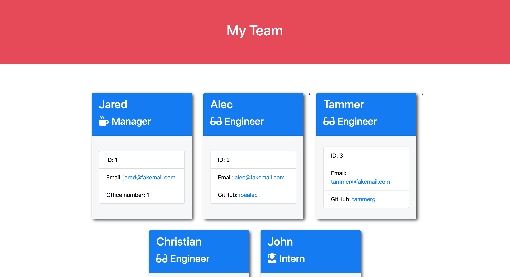

# Employee Summary Project Builder

## Overview

```
As a manager
I want to generate a webpage that displays my team's basic info
so that I have quick access to emails and GitHub profiles
```

## Table of Contents

* [Features](#Features) <br>

* [Images](#Images) <br>

* [Test](#Test) <br>

* [Contributions](#Contributions) <br>

* [Utilizes](#Utilizes) <br>

* [License](#License) <br>

* [GitHub](#Github) <br>

* [Questions](#Questions) <br>


## Features

How do you deliver this? Here are some guidelines:

* Use the [Inquirer npm package](https://github.com/SBoudrias/Inquirer.js/) to prompt the user for their email, id, and specific information based on their role with the company. For instance, an intern may provide their school, whereas an engineer may provide their GitHub username.

* Your app will run as a Node CLI to gather information about each employee.

* Below is an example of what your application may look like. Remember, the styling is completely up to you so try to make it unique.




In the `Develop` folder, there is a `package.json`, so make sure to `npm install`.

The dependencies are, [jest](https://jestjs.io/) for running the provided tests, and [inquirer](https://www.npmjs.com/package/inquirer) for collecting input from the user.

There are also unit tests to help you build the classes necessary.

## Test

Extensive testing has been done and information populates correctly into all fields.

```
lib/           // classes and helper code
output/        // rendered output
templates/     // HTML template(s)
test/          // jest tests
  Employee.test.js
  Engineer.test.js
  Intern.test.js
  Manager.test.js
app.js         // Runs the application

```
## Images

  
  
  
  


## Utilizes

* HTML

* Basic CSS

* node.JS

* Excessive usage of backend Javascript

* Functional application for users to utilize.

* User can use the CLI to generate an HTML page that displays information about their team.


### Classes
The project includes the following classes: `Employee`, `Manager`, `Engineer`,
`Intern`. The tests for these classes in the `tests` directory have all passed.

The first class is an `Employee` parent class with the following properties and
methods:

  * name
  * id
  * email
  * getName()
  * getId()
  * getEmail()
  * getRole() // Returns 'Employee'

The other three classes will extend `Employee`. 

In addition to `Employee`'s properties and methods, `Manager` will also have:

  * officeNumber

  * getRole() // Overridden to return 'Manager'

In addition to `Employee`'s properties and methods, `Engineer` will also have:

  * github  // GitHub username

  * getGithub()

  * getRole() // Overridden to return 'Engineer'

In addition to `Employee`'s properties and methods, `Intern` will also have:

  * school 

  * getSchool()

  * getRole() // Overridden to return 'Intern'

### User input

The project prompts the user to build an engineering team. An engineering
team consists of a manager, and any number of engineers and interns.

### Roster output

The project generates a `team.html` page in the `output` directory, that displays a nicely formatted team roster. Each team member should display the following in no particular order:

  * Name

  * Role

  * ID

  * Role-specific property (School, link to GitHub profile, or office number)

## Contribuitions

Isaac Frishman. This project was completed as part of the full-stack development program through Michigan State University.

## License

Copyright 2020 Isaac Frishman

## Github

[Direct Link To Project](https://github.com/blackedoutkeys/EmployeeBreakdownSummary) <br>

## Questions

[Github Profile](https://github.com/blackedoutkeys) <br>